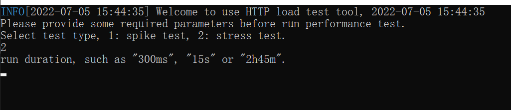

# GoTest

本项目基于Go 1.18开发，本产品主要功能是用于完成性能测试工作。

# 产品特点
- 本产品开源&免费；
- 支持“压力测试”，“尖峰测试”两种常用的性能测试场景；
- 在使用该产品完成单机性能测试工作时，上手非常简单（基于命令行窗口+配置文件方式）；
- 基于go协程完成多用户并发模拟，非常明显的提升了单位资源利用率（单位资源可以支持的并发更高）；
- 涵盖了常见的客户端性能统计指标，包括：TPS,AVG-RTT,TP50,TP90,TP99等；
- 实时统计单位时间（秒）的性能测试指标，以及汇总整个压测过程的性能测试结果；
- 仅支持HTTP协议接口性能测试；

# 使用介绍
1. 根据操作系统类型，选择合适的平台完成编译（在源码http目录下有在windows系统可执行文件，gotest.exe）。
2. 准备HTTP请求参数，创建gotest.json文件：
``` json
{
    "transId": "baidu",
    "url":"http://www.baidu.com",
    "method": "GET",
    "params": {"name": "李小龙", "age": 33},
    "body": "hello",
    "headers": {
        "Content-Type": "application/json;charset=utf8"
    }
}
```
    请求参数说明：
    transId： 为请求自定义事务ID
    url： HTTP请求地址
    method：HTTP 请求方法
    params：HTTP请求查询参数（该参数会转换成query string附加到请求url中）
    body：HTTP请求消息体
    headers：HTTP请求头

3. 配置测试行为（可选），创建gotest.ini文件
```
#请求处理时间阈值，当请求处理时间超过该值时，将请求记录到日志中，单位:ms
http.request.slow.threshold=10000
```

4. 准备工作结束！将gotest.json，gotest.ini，gotest.exe放在同一目录中。
5. 运行gotest.exe，运行结果如图：


    选择执行的测试场景，1代表“尖峰测试”，2代表“压力测试”

6. 以“压力测试”为例，在上一步输入2之后如图：


    比如，我们让压力测试执行10秒钟，那我们输入"10s"，回车！

7. 提供并发数(虚拟用户数)：


8. 执行请求参数gotest.json，默认路径"./gotest.json"。
9. 回车，等待测试执行完成，测试执行完成后会将测试报告写入./testReport.txt文件中！